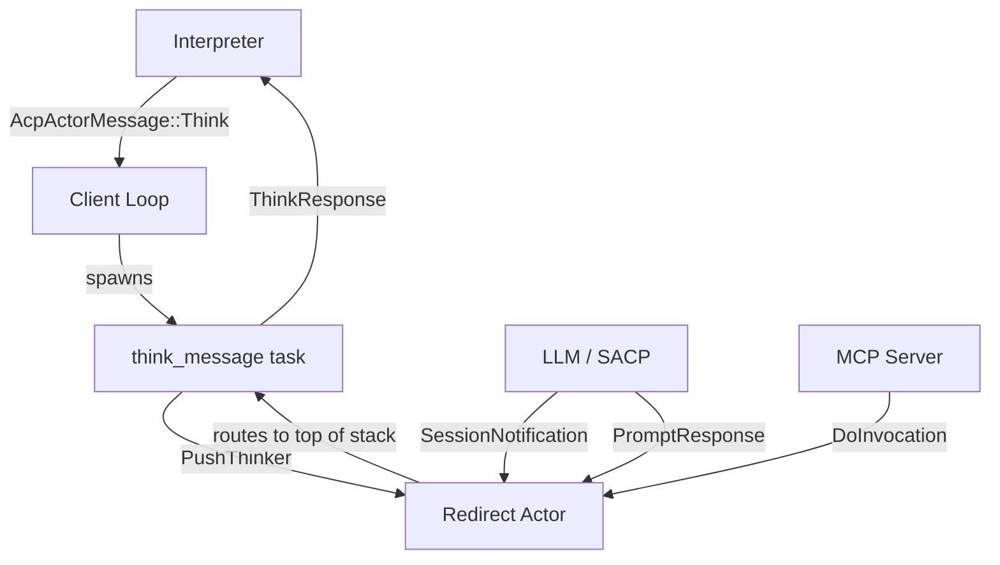
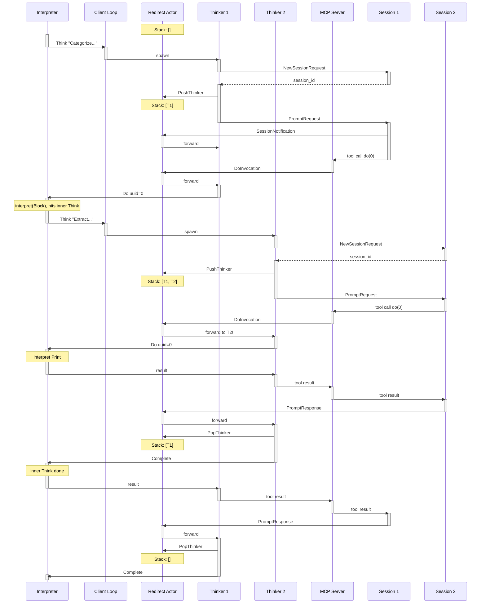

# The Agent

This chapter explains how the agent manages concurrent LLM sessions and routes messages to the right place. We'll trace through the same nested example, but from the agent's perspective.

## The Challenge

When the interpreter sends a `Think` request, the agent needs to:
1. Start an LLM session
2. Route incoming messages (notifications, tool calls, responses) to the right handler
3. Handle nested `Think` requests that arrive while an outer one is still active

The tricky part is #3. When the outer LLM calls `do(0)`, the interpreter might execute another `Think`, creating an inner LLM session. Messages from the inner session shouldn't go to the outer handler.

## Architecture Overview

The agent has four concurrent pieces:



1. **Client Loop** - Receives `Think` requests from interpreter, spawns `think_message` tasks
2. **Redirect Actor** - Maintains a stack of thinkers, routes all incoming messages to top of stack
3. **think_message task** - One per active Think; manages a single LLM session
4. **MCP Server** - Handles `do` tool calls from the LLM

## The Client Loop

When the agent starts, it enters a loop waiting for messages from the interpreter:

```rust
while let Some(message) = rx.recv().await {
    match message {
        AcpActorMessage::Think { prompt, tx } => {
            cx.spawn(Self::think_message(
                cx.clone(),
                prompt,
                tx,           // channel back to interpreter
                redirect_tx,  // channel to redirect actor
                mcp_registry,
            ))?;
        }
    }
}
```

Each `Think` request spawns a new `think_message` task. This is important: multiple thinks can be in flight concurrently (though in our example, they nest rather than run in parallel).

## The think_message Task

Each `think_message` task:
1. Creates an LLM session
2. Registers itself with the redirect actor (push onto stack)
3. Sends the prompt to the LLM
4. Processes messages from its channel until the LLM completes
5. Unregisters from the redirect actor (pop from stack)
6. Sends the final result back to the interpreter

```rust
async fn think_message(...) {
    // 1. Create session
    let session_id = cx.send_request(NewSessionRequest { ... }).await?;

    // 2. Push onto stack
    let (think_tx, mut think_rx) = channel(128);
    redirect_tx.send(RedirectMessage::PushThinker(think_tx));

    // 3. Send prompt (response will arrive via redirect actor)
    cx.send_request(PromptRequest { session_id, prompt })
      .await_when_result_received(|response| {
          redirect_tx.send(PromptResponse(response))
      });

    // 4. Process messages
    while let Some(message) = think_rx.recv().await {
        match message {
            SessionNotification(n) => /* accumulate text */,
            DoInvocation(arg, do_tx) => {
                // Tell interpreter to execute subroutine
                interpreter_tx.send(ThinkResponse::Do { uuid: arg.number, do_tx });
            }
            PromptResponse(r) => break,
        }
    }

    // 5. Pop from stack
    redirect_tx.send(RedirectMessage::PopThinker);

    // 6. Send result to interpreter
    interpreter_tx.send(ThinkResponse::Complete { message: result });
}
```

## The Redirect Actor

The redirect actor is a simple loop that maintains a stack:

```rust
async fn redirect_actor(mut rx: Receiver<RedirectMessage>) {
    let mut stack: Vec<Sender<PerSessionMessage>> = vec![];

    while let Some(message) = rx.recv().await {
        match message {
            IncomingMessage(msg) => {
                // Route to top of stack
                if let Some(sender) = stack.last() {
                    sender.send(msg).await;
                }
            }
            PushThinker(sender) => stack.push(sender),
            PopThinker => { stack.pop(); }
        }
    }
}
```

All incoming messages go to whoever is on top of the stack. This is the key insight: when nested thinks are active, the inner one is on top, so it receives messages from its LLM session.

## The MCP Server

When the LLM calls the `do` tool, the MCP server handles it:

```rust
McpServer::new().tool_fn("do", async move |arg: DoArg, _cx| {
    // Create a oneshot channel for the result
    let (do_tx, do_rx) = oneshot::channel();

    // Send through redirect actor to current thinker
    main_loop_tx.send(DoInvocation(arg, do_tx));

    // Wait for interpreter to execute and return result
    Ok(DoResult { text: do_rx.await? })
})
```

The MCP server doesn't know which thinker to send to - it just sends to the redirect actor, which routes to the top of the stack.

## Full Trace: Nested Think

Let's trace through the nested example with all the agent components:



## Why This Design?

The stack-based routing is a workaround for a limitation: SACP doesn't currently provide per-session message routing. Ideally, each `think_message` would have its own isolated message stream, and we wouldn't need the redirect actor at all.

The comment in the code captures this sentiment:

> "OK, I am a horrible monster and I pray for death."

A future version of the SACP client library will likely provide cleaner abstractions, eliminating the need for manual stack management.
