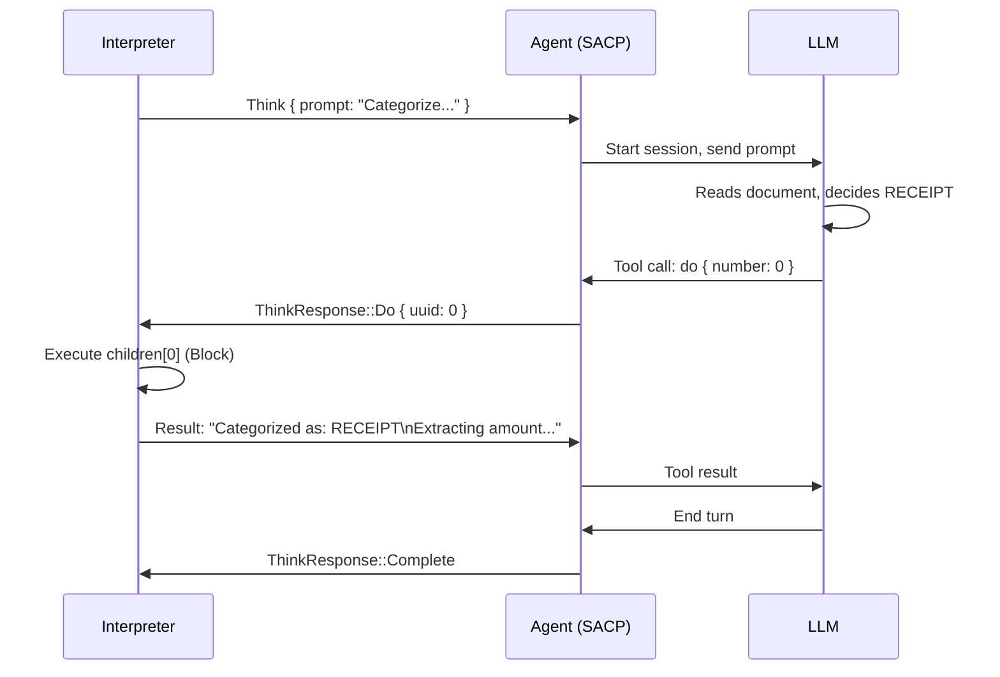

# An Example: Document Categorization

Let's walk through a concrete example. Imagine a program that categorizes a document and takes different actions based on the category.

## The Program

```json
{
  "Think": {
    "think": {
      "prompt": "You are categorizing a document. Based on the content below, decide its type. Call do(0) if it's a RECEIPT, do(1) if it's a CONTRACT, or do(2) if it's PERSONAL correspondence.\n\nDocument content:\n[... invoice for $542.00 from Acme Corp ...]",
      "children": [
        {
          "Block": {
            "children": [
              { "Print": { "message": "Categorized as: RECEIPT" } },
              { "Print": { "message": "Extracting amount..." } }
            ]
          }
        },
        {
          "Block": {
            "children": [
              { "Print": { "message": "Categorized as: CONTRACT" } },
              { "Print": { "message": "Flagging for legal review..." } }
            ]
          }
        },
        {
          "Print": { "message": "Categorized as: PERSONAL" }
        }
      ]
    }
  }
}
```

## What Happens

1. The interpreter encounters the Think node
2. It sends the prompt to the LLM via SACP
3. The LLM reads the document content, decides it's a receipt
4. The LLM calls `do { "number": 0 }`
5. The interpreter executes `children[0]` - the Block that prints "RECEIPT" and "Extracting amount..."
6. The result is returned to the LLM
7. The LLM finishes its turn
8. The interpreter continues

## Sequence Diagram



## Nested Thinking

What if the "extract amount" step also needs LLM judgment? We can nest a Think inside the receipt handler:

```json
{
  "Think": {
    "think": {
      "prompt": "Categorize this document. do(0)=RECEIPT, do(1)=CONTRACT",
      "children": [
        {
          "Block": {
            "children": [
              { "Print": { "message": "Categorized as: RECEIPT" } },
              {
                "Think": {
                  "think": {
                    "prompt": "Extract the dollar amount from this receipt. do(0) to confirm extraction.",
                    "children": [
                      { "Print": { "message": "Amount: $542.00" } }
                    ]
                  }
                }
              }
            ]
          }
        },
        { "Print": { "message": "Categorized as: CONTRACT" } }
      ]
    }
  }
}
```

Now when the outer LLM calls `do(0)`, the interpreter runs the Block, which includes another Think. This spawns a *second* LLM session to extract the amount.

The next two chapters walk through how this nesting works in detail - first from the interpreter's perspective, then from the agent's.
